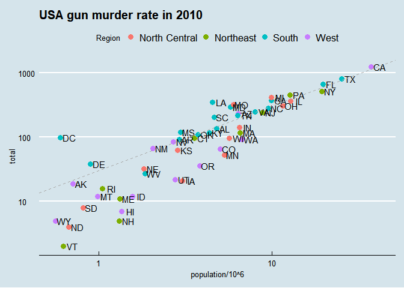

Report on USA gun murder
================
Kaycee
19 June 2018

Introcution
-----------

This is a report on 2010 gun murder rates obtained from FBI reports. The original data wa obtained from \[this wikipedia page\] (<https://en.wikipedia.org/wiki/Murder_in_the_United_States_by_state>).

When you click the **Knit** button a document will be generated that includes both content as well as the output of any embedded R code chunks within the document. You can embed an R code chunk like this:

We are going to use the following library:

``` r
library(tidyverse,ggthemes)
```

and load the data we arleady wrangled:

``` r
load("rda/murders.rda")
```

Murder rate by state
--------------------

We note the large state tp state variability by generating a barplot showing the murder rate by state:


